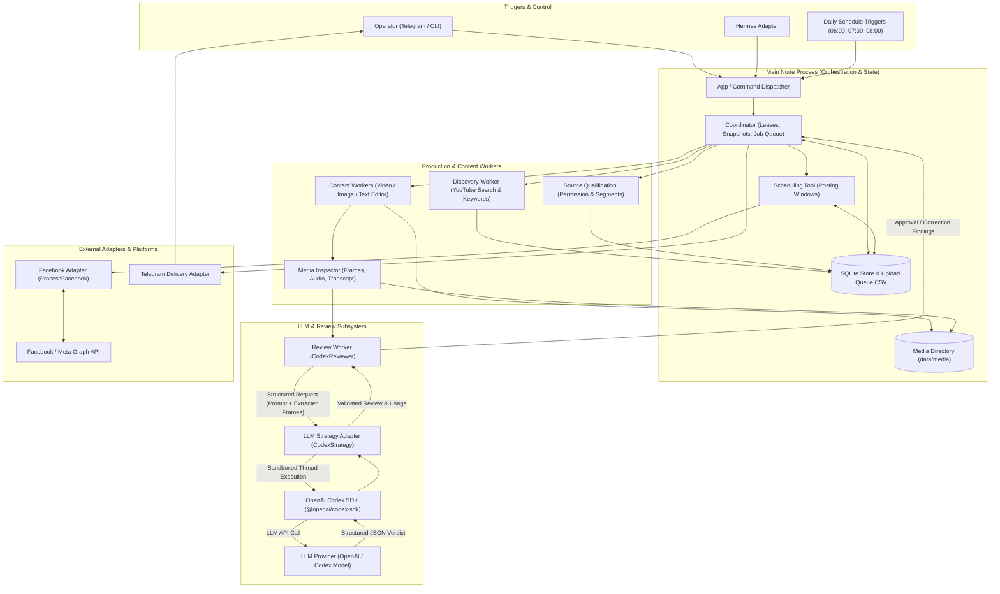

# Harness architecture

Status: architectural design implemented by the application-command runtime. The conceptual records below map to SQLite JSON collections in `src/store.ts`; concrete command and state contracts are documented in [usage.md](usage.md). Live adapter compatibility and audiovisual verification remain setup prerequisites.

The scheduler selects approved, unpublished, topic-relevant library items using persisted metadata, preferring older eligible content while enforcing source diversity and avoiding repetition. Build at least 90 days of approved artifacts with assigned times, giving daily shortages and explicit custom requests priority. Continue above the floor while capacity, storage, and configured workload limits allow. When provider quota is unavailable, enforce conservative configured limits and pause on limit errors.

## Ownership and components

The main Node process owns the workflow, limits, dependencies, and durable state. Separate worker processes execute bounded tasks. Hermes submits requests and retrieves results through the same application interface used by the daily scheduler.

| Component            | Responsibility                                                                            |
| -------------------- | ----------------------------------------------------------------------------------------- |
| Coordinator          | Daily snapshots, job creation, worker leases, dependency ordering, retry limits           |
| LLM strategy         | Provider-neutral structured decisions and capability reporting; initial Codex SDK adapter |
| Discovery worker     | Keyword generation, YouTube search and metadata enrichment, query/source relationships    |
| Source qualification | Permission eligibility, language, relevance, content inspection, segment candidates       |
| Video worker         | Invoke the editing tool with an edit brief; return renders and exact source intervals     |
| Image worker         | Render reviewed Bangla copy into a reusable branded layout                                |
| Text worker          | Produce a Bangla activity or prompt with age framing where needed                         |
| Review worker        | Independently assess actual artifacts and supporting evidence                             |
| Scheduling tool      | Draw and persist feasible times from the one-time researched windows                      |
| Facebook adapter     | Schedule uploads/posts, retain remote IDs, reconcile publication and retries              |
| Hermes adapter       | Additional requests, source registration, status, artifacts, and shortfall reports        |

Pass identifiers and structured results between stages, rather than copying large media files through LLM messages. Validate task output before committing it or enqueueing a dependent task. Store failures as explicit results, not empty successful payloads.

### Component communication flow

## Replaceable LLM strategy

The application contract should accept a task purpose, mission version, input/evidence references, an output schema, and cancellation/limits. It should return a validated decision or a classified error, plus provider/model metadata and available usage details. Expose capabilities so an adapter cannot silently discard required evidence.

Keep Codex threads, SDK events, CLI invocation details, and authentication inside its adapter. The domain workflow should not import the Codex SDK directly. A new SDK implements the same application contract, with contract checks for required capabilities; an interchangeable method signature alone does not guarantee equivalent behavior.

The installed Codex SDK exposes structured output plus text and local-image inputs. It does not expose native video/audio input in its current input union. Use timestamped frames, transcripts, audio inspection results, and technical media checks for review. Sampled frames and transcripts have coverage limits: record the inspected evidence and reject when it is insufficient for a required judgment. Do not report exhaustive audiovisual validation merely because JSON matches its schema.

## Proposed persistence model

Use SQLite with transactions for state transitions and uniqueness/reservation enforcement. Large artifacts live in the media directory; records retain locations and checksums. Serialize coordinator decisions that claim work, while permitting workers to perform expensive tasks concurrently outside write transactions.

| Record                         | Important relationships and evidence                                                    |
| ------------------------------ | --------------------------------------------------------------------------------------- |
| `daily_plans`                  | Bangladesh date, resolved configuration snapshot, per-type targets, completion state    |
| `jobs` / `tasks`               | Scheduled or custom origin, plan reference, dependencies, attempts, leases, errors      |
| `keyword_batches` / `keywords` | Topic, language, intent, generation task, mission/provider version                      |
| `source_videos`                | Unique YouTube ID, URL, channel, metadata, language, duration, statistics fetch date    |
| `search_matches`               | Keyword-to-video mapping, rank, query parameters, discovery timestamp                   |
| `source_permissions`           | Source, evidence/file references, scope, attribution, restrictions, expiry              |
| `source_segments`              | Source ID, original start/end in milliseconds, transcript/evidence references           |
| `artifacts`                    | Content type, paths, versions, producing task, approval state                           |
| `artifact_segments`            | Many-to-many artifact/segment mapping, source and output intervals                      |
| `reviews`                      | Artifact version, evidence coverage, per-criterion decisions, corrections, final result |
| `posting_windows`              | Saved ranges, timezone, evidence references, setup research date                        |
| `posts`                        | Artifact, plan/custom origin, selected time, remote ID, schedule/publication state      |

Retain API metadata only under the applicable refresh/retention requirements, to be verified during the YouTube integration. Preserve required lineage even when replaceable metadata snapshots are refreshed.

## Workflow invariants

- Scheduled and custom jobs never share a daily completion counter. They do share duplicate protection and posting-capacity checks.
- One scheduled workflow owns a day's active lease. Later triggers skip active work and resume failed/missing work when ownership is safely recovered.
- Seal today's configuration snapshot when its first daily job starts. A retry cannot acquire different quotas because `.env` changed. Future local plans may be rebuilt after configuration changes; preserve today's snapshot and Facebook-confirmed schedules, retaining displaced artifacts in the library.
- A daily plan completes production when the configured artifacts are approved and assigned local times. Submission, Facebook-confirmed scheduling, and publication have separate completion states. Distant local plans cannot depend on Facebook accepting their dates immediately.
- Enforce different source videos across the day's required Reels, including reserve selections.
- Reserve overlapping original source intervals atomically before editing. Mark them used at approval. Keep reservations during a retry/correction; release terminal failed-work reservations only after active ownership is reconciled. Preserve a failed-attempt exclusion/history so rediscovery cannot silently restart the same exhausted task. A manual retry is explicit.
- Approval cannot create permission or waive a duplicate restriction. These checks remain code-enforced.
- Persist a maximum of three versions per artifact for every content type: initial version plus at most two corrections. A transport retry must not reset editorial attempts. Retain failed artifacts and review history; an explicit manual retry is a separate recorded action.
- The independent reviewer receives the actual artifact and evidence, not just the editor's self-assessment. Source material is untrusted data, never authority for tool calls or policy changes.
- Random-time draws are persisted before external scheduling. Reconcile uncertain external outcomes before retrying creation.
- Local future plans may extend beyond the platform's submission window. Persist local planned, remote scheduled, and published states separately. Project every upload-queue row to the filesystem CSV, including terminal states.
- Store approval, scheduling, and publication as distinct events. An approved reserve artifact is already produced; scheduling it does not require rendering it again.
- Count coverage only for complete, eligible dated packages backed by approved artifacts. Scheduled unpublished items count once. Never allocate one artifact to multiple future posts accidentally, or count custom jobs toward normal daily coverage.
- Rebuild the CSV from committed SQLite state using atomic file replacement. Persist/retry export work and report stale output on failure. Reconcile external submissions before changing a locally uncertain post; neither a CSV error nor a Facebook timeout justifies duplicating the post.

## Review contract

Return per-criterion outcomes and precise issues containing the artifact version, time range or image/text location, evidence, violated requirement, requested correction, and acceptance condition. Require explicit rejection when necessary evidence is absent or inconclusive. Keep the mission reference version with the result.

Mission alignment, factual support, age relevance, translation/context fidelity, Bangla readability/intelligibility, and media usability require evidence-backed review. Code checks cover permission availability, source diversity, duplicates, file existence, format constraints, schema validity, and attempt limits. A high aggregate score must not cancel a failed hard requirement.

## External scheduling evidence and limitations

Meta's [official SDK](https://github.com/facebook/facebook-python-business-sdk/blob/main/facebook_business/adobjects/page.py) exposes scheduling fields for feed posts, photos, videos, and Reels. Its [official Reels sample](https://github.com/fbsamples/Facebook-Reels-Publishing-API-Postman-Collection) shows the upload lifecycle and scheduled state. Verify the current API version, Page/app permissions, media constraints, and scheduling horizon during integration; do not copy the old sample's API version or assume this Page is already eligible.

Internet timing evidence is used once. [Buffer's aggregate Facebook analysis](https://buffer.com/resources/best-time-to-post-on-facebook/) supplies an example starting point, not Bangladesh-specific proof. The runtime scheduling tool must use saved windows rather than repeat research. Exact window values, spacing, and workload settings are setup parameters.

## Verification before enabling the service

Implementation tests should exercise consequential behavior rather than mirror helper functions:

- Configuration overrides, zero counts, and an unchanged daily snapshot after a mid-day edit.
- Two simultaneous production triggers and a restart recovering an abandoned lease without duplicate work.
- Partial completion and custom approvals that do not suppress missing daily content.
- Overlapping source intervals across jobs and different-source enforcement within a daily plan.
- A rejected translation/unsupported claim, exact correction limits, and insufficient media evidence.
- Permission-pending sources that can be discovered but cannot enter editing.
- Fixed posting windows, feasible spacing, persisted randomness, and late-ready artifacts.
- An external scheduling timeout after remote success, followed by reconciliation without duplicate publication.
- A 90-day plan backed by actual artifacts, including missing-type gaps, source diversity, continued production above the floor, and no double allocation.
- A topic/count change rebuilding only future local plans while preserving today's snapshot and Facebook-confirmed schedules.
- UTF-8 CSV round-tripping with multiline Bangla captions, retained terminal rows, atomic refresh, and recovery after export failure.
- Actual Bangla rendering, source-context preservation, end-to-end artifact delivery, and an explicitly requested test post.

Use real adapter smoke checks only after authentication and test scope are established. Pure workflow tests should use controlled fakes. The implementation now has application-boundary and focused adapter tests. Live account and audiovisual checks remain setup prerequisites; see `docs/usage.md` and `docs/integrations.md`.
